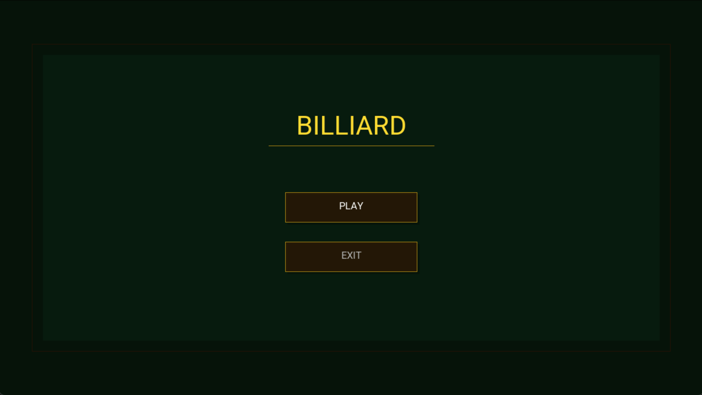
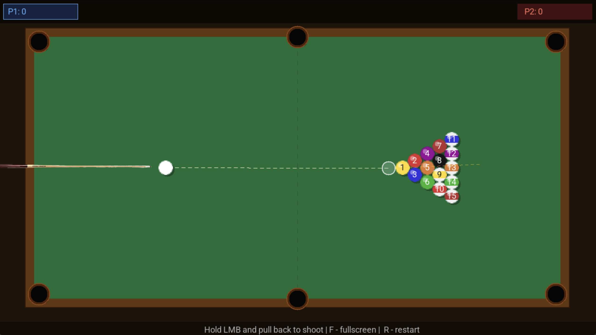
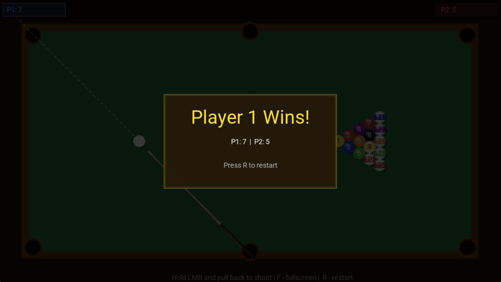

# 🎱 Billiard

> A cross-platform 2D billiard game built in C11 with SDL2. Two players, realistic ball physics, ghost ball aiming and cue pull-back mechanics.


[](LICENSE)
---

## Preview

<div align="center">

<br/><br/>

<br/><br/>

</div>

---

## Features

- **15-ball triangle** rack with numbered balls (1–15)
- **Striped balls** (9–15) and solid balls (1–7)
- **Ghost ball** aim line — shows exactly where cue ball will hit
- **Pull-back shot** mechanics — drag to set power, release to shoot
- **Two-player** turn system with individual scores
- **Black ball rule** — pocketing the 8 instantly loses the game
- **Pocket detection** on all 6 pockets
- **Cue stick** texture with rotation
- **Fullscreen / windowed** toggle
- **Win screen** with player scores

---

## Controls

| Action       | Input                          |
| ------------ | ------------------------------ |
| Aim          | Move mouse                     |
| Shoot        | Hold `LMB`, pull back, release |
| Fullscreen   | `F`                            |
| Back to menu | `ESC`                          |
| Restart      | `R`                            |
| Quit         | `ESC` from menu                |

---

## Build

### Requirements

| Tool                            | Version     |
| ------------------------------- | ----------- |
| C compiler (Clang / GCC / MSVC) | C11 support |
| CMake                           | 3.16+       |
| Git                             | any         |

- **macOS** — SDL2 libraries are downloaded automatically via CMake FetchContent
- **Windows** — SDL2 binaries are included in the repository under `libs/`

---

### macOS

```bash
git clone https://github.com/haammi/billiard.git
cd billiard
mkdir build && cd build
cmake ..
cmake --build .
cd ..
./build/billiard
```

---

### Windows

**Option 1 — MinGW**

```bash
git clone https://github.com/haammi/billiard.git
cd billiard
mkdir build
cd build
cmake .. -G "MinGW Makefiles"
cmake --build .
cd ..
build\billiard.exe
```

**Option 2 — MSVC (Visual Studio)**

```bash
git clone https://github.com/haammi/billiard.git
cd billiard
mkdir build
cd build
cmake ..
cmake --build . --config Release
cd ..
build\Release\billiard.exe
```

> **Note:** Always run from the project root — the game loads assets from the `assets/` folder relative to the working directory.

---

## Project Structure

```
billiard/
├── CMakeLists.txt
├── libs/
│   ├── SDL2/
│   ├── SDL2_ttf/
│   ├── SDL2_image/
│   └── SDL2_mixer/
├── assets/
│   ├── font.ttf
│   ├── cue.png
│   ├── hit.wav
│   ├── wall.wav
│   └── pocket.wav
└── src/
        ├── main.c
        ├── game.c / game.h       ← game loop, state, players
        ├── ball.c / ball.h       ← ball rendering, physics update
        ├── physics.c / physics.h ← collision resolution
        ├── input.c / input.h     ← mouse input, cue, aim line
        ├── table.c / table.h     ← table rendering, pocket detection
        ├── hud.c / hud.h         ← score display, win screen
        ├── menu.c / menu.h       ← main menu
        └── audio.c / audio.h     ← sound effects
```

---

## Rules

1. Players alternate turns
2. Scoring a ball keeps your turn
3. Cue ball in pocket — respawns at start position
4. Pocketing the **8-ball** at any time — **instant loss**
5. All 15 balls pocketed — game ends, highest score wins

---

## Tech Stack

- **C11** — no C++
- **SDL2** — window, renderer, events
- **SDL2_ttf** — font rendering
- **SDL2_mixer** — audio
- **SDL2_image** — PNG texture loading
- **CMake + FetchContent** — cross-platform build, no system dependencies

